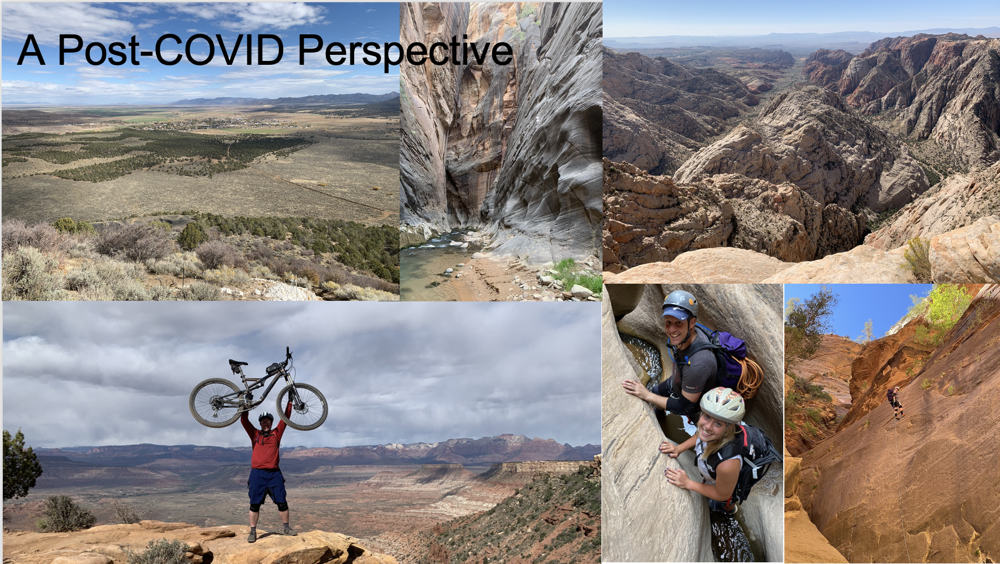

```{r setup, include=FALSE}
knitr::opts_chunk$set(echo = TRUE, fig.align="center")
img_path <- "introFigs/"
```

# Introductions


## 



## 


## 


## 


## Johnson Lab Research

[Here is a link to the Johnson Lab Research Page](https://www.wejlab.org)

# Course Introduction

## Things you should know about this course

* Lots of diverse material
    + Not a spectator sport!
* Zoom Meeting ID for all sessions is 95398689633, passcode: 065918: 
    + [Click here for the direct Zoom link](https://rutgers.zoom.us/j/95398689633?pwd=fLMqBabEI3KR9qFIFYbswe08IdZM1Q.1)
    + Lectures will be recorded and posted in the "Announcements" (Canvas)
* Canvas: 
    + The Canvas page will be limited confidential items: course announcements, communication, homework submissions, grades, etc. 
* GitHub: [https://github.com/wevanjohnson/2025_Spring_FDS](https://github.com/wevanjohnson/2025_Spring_FDS)
    + Course information, schedule, lecture notes, homework, etc.
    + [Link to Syllabus](https://github.com/wevanjohnson/2025_Spring_FDS/blob/main/Fundamentals_Syllabus.docx)
* You need to have a basic understanding of statistics
* Learning to program in R is a requirement of this course. 

## Resources for learning statistics

Here are some resources to learn basic statistics (and in some cases R simultaneously):  

* [Data Analysis with R Specialization (Coursera/Duke University)](https://www.coursera.org/specializations/statistics?irclickid=w9MUi9wpwxyPTCxztt2SI17tUkFyAhzKk1fbyE0&irgwc=1&utm_medium=partners&utm_source=impact&utm_campaign=2890636&utm_content=b2c)
* [Introduction to statistics (Coursera/Stanford)](https://www.coursera.org/learn/stanford-statistics)


## Resources for learning R

For learning R:

* [RStudio Education](https://education.rstudio.com/learn/beginner/)
* [R Programming (Coursera/Johns Hopkins)](https://www.coursera.org/learn/r-programming?specialization=jhu-data-science&utm_medium=sem&utm_source=gg&utm_campaign=B2C_NAMER_jhu-data-science_jhu_FTCOF_specializations_country-US-country-CA&campaignid=313639147&adgroupid=121203872804&device=c&keyword=&matchtype=&network=g&devicemodel=&adposition=&creativeid=507187136066&hide_mobile_promo&gclid=Cj0KCQjw9MCnBhCYARIsAB1WQVUuUyr1GQeQWOkLR-d9lj60pyAih9-5wg__yNgm-L0-VQPrvuZQFtEaApQ5EALw_wcB)
* [Data Science R Basics (edx/Harvard University)](https://www.edx.org/learn/r-programming/harvard-university-data-science-r-basics?irclickid=V9eQWSwpwxyPTCxztt2SI17tUkFyAmzqk1fbyE0&utm_source=affiliate&utm_medium=Hackrio&utm_campaign=edX%20Tracking%20Link_&utm_content=TEXT_LINK&irgwc=1)
* [R Training Course (LinkedIn)](https://www.linkedin.com/learning/learning-r)
* [R Programming A - Z: R for Data Science (Udemy)](https://www.udemy.com/course/r-programming/?ranMID=39197&ranEAID=jU79Zysihs4&ranSiteID=jU79Zysihs4-5fxuDsdoyms05cRQ5nTs7Q&LSNPUBID=jU79Zysihs4&utm_source=aff-campaign&utm_medium=udemyads)
* [Programming with R (Pluralsight)](https://www.pluralsight.com/courses/programming-with-r?aid=7010a000001xAKZAA2&clickid=w9MUi9wpwxyPTCxztt2SI17tUkFyAj2Lk1fbyE0&irgwc=1&mpid=2890636&utm_campaign=2890636&utm_medium=digital_affiliate&utm_source=impactradius)


## Dr. Johnson's R Tutorials (GitHub and YouTube)
Dr. Johnson will provide an online R tutorial on GitHub: [https://github.com/wevanjohnson/2025_01_R_tutorial](https://github.com/wevanjohnson/2025_01_R_tutorial)

## R Tutorials (GitHub and YouTube)
Lectures 1-6 will give you the R basics you need for the course. Lectures 7-12 will have some overlap with this course (Weeks 5-7).  

\scriptsize
| Lecture     | Topics                                |
| :-----------| :------------------------------------ |
| Lecture 1   | Installing R, RStudio, and R packages |
| Lecture 2   | Objects, workspace, functions, scripts|
| Lecture 3   | Vectors, factors, lists, data frames  |
| Lecture 4   | Sorting, arithmetic, basic plots      |
| Lecture 5   | Logic and Conditionals                |
| Lecture 6   | Loops, vectorization, functions       |
| Lecture 7   | Literate programming with R Markdown  |
| Lecture 8   | Input/output data, Data structures    |
| Lecture 9   | The tidyverse                         |
| Lecture 10  | Visualization with ggplot2            |
| Lecture 11  | Creating R Packages                   |
| Lecture 12  | Shiny Programming                     |

# Introduction to Data Science 

##
\center


Big Data has fundamentally changed how we look at science and business. Along with advances in analytic methods, they are providing unparalleled insights into our physical world and society

## Structured vs. Unstructured data
\center


## Structured vs. Unstructured data
\center


## Data Science Revolution
\begin{columns}
	\begin{column}{0.5\textwidth}
	\includegraphics[width=2.5in]{introFigs/ds_venn.png}
	\end{column}
	
	\begin{column}{0.5\textwidth}
{
	\begin{itemize}
	\item Few have all the skills	
	\item Flexibility in area (business, strategy, health care) and conditions
	\item Data science makes companies and data better! 
	\end{itemize}
}
	\end{column}
\end{columns}

##
\center


## Data Science Process


## Scientific Cycle for Data Science
Johnson Lab Approach to Science:
\center


# Keeping the "Science" in Data Science

## Domain Knowledge

**Domain knowledge** is knowledge of a specific, specialized discipline or field, in contrast to general (or domain-independent) knowledge. For example, in describing a software engineer may have general knowledge of computer programming as well as domain knowledge about developing programs for a particular industry. People with domain knowledge are often regarded as specialists or experts in their field. (Wikipedia!)

## Analytics Hierarchy
\center
{height="80%"}


## Analytics Hierarchy
\center
{height="80%"}

## Session info
\tiny
```{r session info}
sessionInfo()
```

