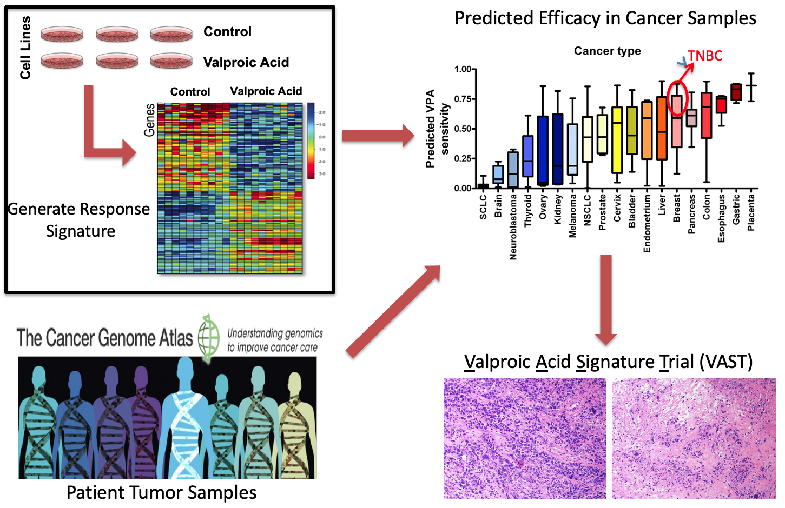
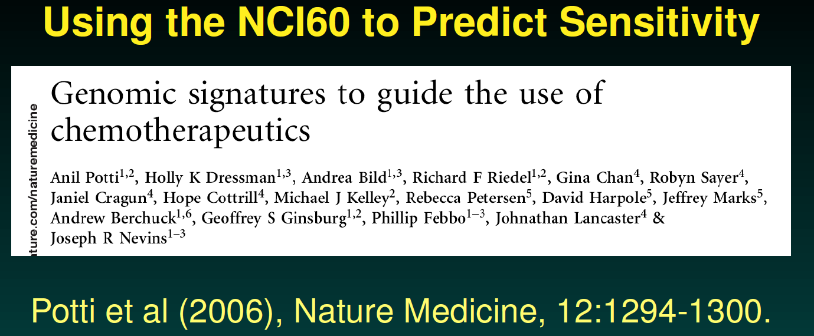
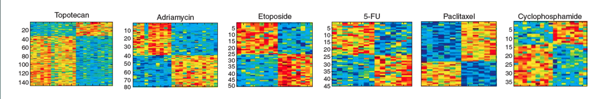
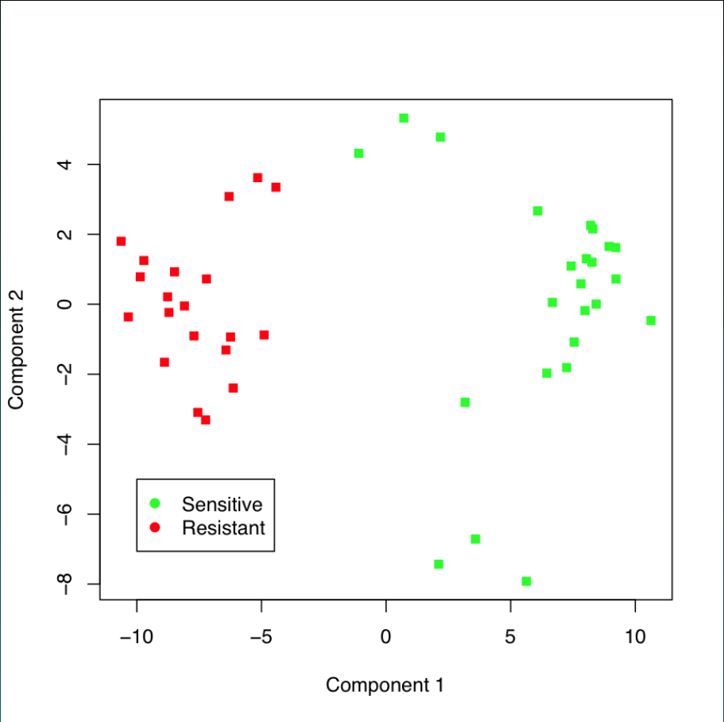
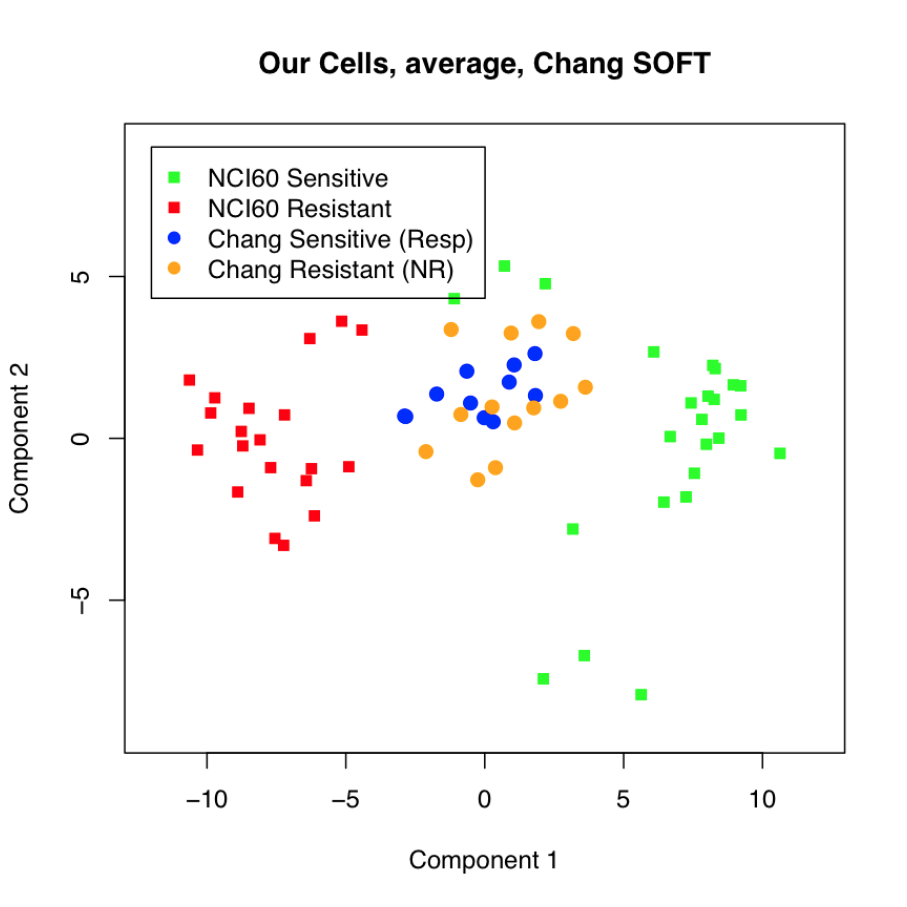
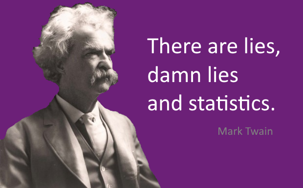

```{r setup, include=FALSE}
knitr::opts_chunk$set(echo = FALSE)
img_path <- "ethicsfigs/"
```

## Credits
- Some of the content in this slide deck is taken and/or modified from "Modern Data Science with R", by Baumer, Caplin, and Horton (Chapman & Hall, 2021)
- This presentation was also enhanced with assistance from ChatGPT, a large language model developed by OpenAI.
- All content was reviewed, modified, and refined by Evan Johnson to ensure accuracy and relevance.

## Introduction to Data Science Ethics

**How do we define Data Science Ethics?**

- Principles guiding responsible use of data science data, tools, and techniques.
- Ensuring fairness, accountability, and transparency.

## Introduction to Data Science Ethics

**Why are ethics important?**

- Data-driven decisions impact individuals and society.
- Ethical breaches can lead to significant harm.

**Example:**

- A machine learning model used for loan approvals discriminates against certain demographic groups due to biased training data or algorithm decisions.

## Key Ethical Principles

**Core Principles:**

- *Privacy*: Respecting individuals' control over their personal data.
  - Example: Ensuring anonymization in healthcare datasets to protect patient identity.
- *Fairness*: Avoiding bias and discrimination in algorithms.
  - Example: Analyzing hiring algorithms to prevent gender or racial bias.
- *Accountability*: Holding creators and users responsible for outcomes.
  - Example: Transparent reporting on AI decision-making processes in criminal justice.
- *Transparency*: Making processes and decisions understandable.
  - Example: Providing clear documentation for AI models used in financial services.


## Data Science Ethics in Medicine and Biomedical Research

Data science plays a critical role in modern medicine, but its application raises important ethical considerations. By prioritizing ethics in data science, we ensure that its application in medicine is beneficial, fair, and secure for all patients. This leads to better healthcare outcomes and greater public trust in the technologies shaping the future of medicine.

## Data Science Ethics in Medicine and Biomedical Research
Here are reasons why we should care about data science ethics in medicine:  

1. Patient Privacy and Confidentiality
2. Bias and Fairness
3. Informed Consent
4. Accountability and Transparency
5. Impact on Health Equity
6. Security and Protection from Harm
7. Regulatory Compliance
8. Responsible AI and Automation
9. Ensuring Accuracy and Validity
10. Long-Term Trust


## "First, do no harm"
The best-known professional ethics standards are those in the Hippocratic Oath for physicians, Originally written in the 5th century B.C. Three of the eight principles include:

* “I will not be ashamed to say ‘I know not,’ nor will I fail to call in my colleagues when the skills of another are needed for a patient's recovery.”
* “I will respect the privacy of my patients, for their problems are not disclosed to me that the world may know.”
* “I will remember that I remain a member of society, with special obligations to all my fellow human beings, those sound of mind and body as well as the infirm.”

## Data Science Ethics
We will introduce principles of professional ethics for data science and give examples of legal obligations, as well as guidelines issued by professional societies. **There is no official data scientist's oath**-—although attempts to forge one exist ([National Academies of Science, Engineering, and Medicine, 2018](https://www.nationalacademies.org/our-work/responsible-computing-research-ethics-and-governance-of-computing-research-and-its-applications#sectionProjectScope)). 

## Data Science Ethics
We will introduce principles of professional ethics for data science and give examples of legal obligations. Reasonable people can disagree about what actions are best, but the existing guidelines provide a description of the ethical expectations on which we can reasonably rely.

## Motivating example: genomic signatures for cancer
\center


## Motivating example: genomic signatures for cancer
\center

(Credit Keith Baggerly and Kevin Coombes)


## Motivating example: genomic signatures for cancer
The main conclusion is that we can use microarray data from cell lines (the NCI60) to define drug response “signatures”, which can be used to predict whether patients will respond.

They provide examples using 7 commonly used agents.


This got people in the research community very excited.

## Motivating example: genomic signatures for cancer
\center
{width="75%"}

(Credit Keith Baggerly and Kevin Coombes)


## Motivating example: genomic signatures for cancer
We want the test data to look like this!
\center
{width="60%"}


## Motivating example: genomic signatures for cancer
But instead it looked like this:
\center
{width="60%"}

## Lying with statistics

\center


## Lying with statistics

The single best-selling book with “statistics” in the title is _How to Lie with Statistics_ by Darrell Huff (Huff, 1954). Written in the 1950s, the book shows graphical ploys to fool people even with accurate data.

One way to think of _How to Lie_ is a text to show the general public what these tacit expectations are and give tips for detecting when the trick is being played on them. 


## Lying with statistics

The book's title, while compelling, has wrongly tarred the field of statistics. The “statistics” of the title are really just “numbers.” 

The misleading graphical techniques are employed by politicians, journalists, and businessmen: not statisticians. More accurate titles would be “How to Lie with Numbers,” or “Don’t be misled by graphics.”

## Role of data science in society

As data scientists, what role do we play in shaping public discourse? What responsibilities do we have? The stakes are high, and context matters.

## Stand Your Ground
In 2005, the Florida legislature passed the controversial “Stand Your Ground” law that broadened the situations in which citizens can use lethal force to protect themselves against perceived threats. Advocates believed that the new law would ultimately reduce crime; opponents feared an increase in the use of lethal force. What was the actual outcome?

## Stand your ground
The graphic is a reproduction of one published by Reuters on Feb. 16, 2014 showing the number of firearm murders in Florida over the years:


## Stand your ground
The misleading data graphic about the “Stand Your Ground” law was published about six months after George Zimmerman was acquitted for killing Trayvon Martin. Did the data graphic affect public perception in the wake of this tragedy?

## Climate change
Another example: a tweet by the National Review on climate change:
\center
{width='60%'}


## Climate change

The x-axis follows the convention: 1880 to 2015 is a reasonable choice when considering the relationship between human industrial activity and climate. 

The y-axis, however, is utterly misleading. The scale goes from -10 to 110 degrees Fahrenheit. While this is a relevant scale for showing season-to-season variation in temperature, that is not the salient issue with respect to climate change. 

The concern with climate change is about rising ocean levels, intensification of storms, ecological and agricultural disruption, etc. These are the anticipated results of a change in global average temperature on the order of 5 degrees Fahrenheit. 

## Climate change

The National Review tweet was published during the thick of the presidential primaries leading up the 2016 election, and the publication is a leading voice in conservative political thought. 

Pew Research reports that while concern about climate change has increased steadily among those who lean Democratic since 2013 (88% said climate change is “a major threat to the United States” in 2020, up from 58% in 2013), it did not increase at all among those who lean Republican from 2010 to mid-2019, holding steady at 25%. Did the National Review persuade their readers to dismiss the scientific consensus on climate change?

## Georgia COVID-19 reporting
In May 2020, Georgia published a misleading graphical display of COVID-19:

\center
{width="90%"}

## Georgia COVID-19 reporting
Note that the results for April 17th appear to the right of April 19th, and that the counties are ordered such that all of the results are monotonically decreasing for each reporting period. 

The net effect of the graph is to demonstrate that confirmed COVID cases are decreasing, but it does so in a misleading fashion. Public outcry led to a statement from the governor's office that moving forward, chronological order would be used to display time.


## Role of data science in society
The misleading data graphic about COVID-19 cases in Georgia was published during a time that Governor Brian Kemp's reopening plan was facing stiff criticism from Atlanta mayor Keisha Lance Bottoms, his former opponent in the governor's race Stacey Abrams, and even President Donald Trump. 

Journalists called attention to the data graphic on May 10th. The Georgia Department of Health itself reports that the 7-day moving average for COVID-19 cases increased by more than 125 cases per day during the two weeks following May 10th. Did the Georgia's governor's office convince people to ignore the risk of COVID-19?

## Some principles to guide ethical action
Previously, we listed three principles from the Hippocratic Oath. The **Data Science Oath**, published by the National Academy of Sciences in 2018, rewrote them as follows:

* I will not be ashamed to say, “I know not,” nor will I fail to call in my colleagues when the skills of another are needed for solving a problem.
* I will respect the privacy of my data subjects, for their data are not disclosed to me that the world may know, so I will tread with care in matters of privacy and security.
* I will remember that my data are not just numbers without meaning or context, but represent real people and situations, and that my work may lead to unintended societal consequences, such as inequality, poverty, and disparities due to algorithmic bias.

## Some principles to guide ethical action
Another set of data science ethical guidelines is the **Data Values and Principles** manifesto published by [DataPractices.org](https://datapractices.org). This document espouses four values and 12 principles. The four values are: 

* Inclusion 
* Experimentation
* Eccountability
* Impact 

## Some principles to guide ethical action
The 12 principles are: 
\scriptsize

1. Use data to improve life for our users, customers, organizations, and communities.
2. Create reproducible and extensible work.
3. Build teams with diverse ideas, backgrounds, and strengths.
4. Prioritize the continuous collection and availability of discussions and metadata.
5. Clearly identify the questions and objectives that drive each project and use to guide both planning and refinement.
6. Be open to changing our methods and conclusions in response to new knowledge.
7. Recognize and mitigate bias in ourselves and in the data we use.
8. Present our work in ways that empower others to make better-informed decisions.
9. Consider carefully the ethical implications of choices we make when using data, and the impacts of our work on individuals and society.
10. Respect and invite fair criticism while promoting the identification and open discussion of errors, risks, and unintended consequences of our work.
11. Protect the privacy and security of individuals represented in our data.
12. Help others to understand the most useful and appropriate applications of data to solve real-world problems.

## Case Studies: the CEO
A statistical consultant once worked for a client who wanted a proprietary model to predict commercial outcomes. After reviewing the literature, an existing multiple linear regression model was found that matched the scenario well, and available public data were used to fit the parameters of the model. The client's staff were pleased with the result, but the CEO wanted a model that would give a competitive advantage. After all, their competitors could easily follow the same process to the same model, so what advantage would the client's company have? The CEO asked the statistical consultant whether the coefficients in the model could be “tweaked” to reflect the specific values of his company. The consultant suggested that this would not be appropriate, that the fitted coefficients best match the data and to change them arbitrarily would be “playing God.” In response, the CEO rose from his chair and asserted, “I want to play God.”

How should the consultant respond? How does this relate to biomedical research? 

## Case Studies: Employment discrimination
Suppose a data scientist works on legal cases arising from audits of employers, conducted by the United States Office of Federal Contract Compliance Programs (OFCCP). In a typical case, the OFCCP asks for hiring and salary data from a company that has a contract with the United States government. The company usually complies, sometimes unaware that the OFCCP applies a method to identify “discrimination” through a two-standard-deviation test outlined in the Uniform Guidelines on Employee Selection Procedures (UGESP). A company that does not discriminate has some risk of being labeled as discriminating by the OFCCP method (Bridgeford, 2014). By using a questionable statistical method, is the OFCCP acting unethically?

## Case Studies: Race prediction
Imai and Khanna, (2016) built a racial prediction algorithm using a Bayes classifer trained on voter registration records from Florida and the U.S. Census Bureau's name list. In addition to the publishing the paper detailing the methodology, the authors published the software for the classifer on GitHub under an open-source license. The wru package is available on CRAN and will return predicted probabilities for a person's race based on either their last name alone, or their last name and their address.

Was the publication of this model ethical? Does the open-source nature of the code affect your answer? Is it ethical to use this software? Does your answer change depending on the intended use?

## Case Studies: Data scraping
In May 2016, the online OpenPsych Forum published a paper by Kirkegaard and Bjerrekaer, (2016) titled “The OkCupid data set: A very large public data set of dating site users.” The resulting data set contained 2,620 variables—including usernames, gender, and dating preferences—from 68,371 people scraped from the OkCupid dating website. The ostensible purpose of the data dump was to provide an interesting open public data set to fellow researchers. These data might be used to answer questions such as this one suggested in the abstract of the paper: whether the zodiac sign of each user was associated with any of the other variables (spoiler alert: it wasn’t).

The data scraping did not involve any illicit technology such as breaking passwords. Nonetheless, the author received many comments on the OpenPsych Forum challenging the work as an ethical breach and accusing him of doxing people by releasing personal data. Does the work raise ethical issues?

## Case Studies: Reproducible spreadsheet analysis
In 2010, Harvard University economists Carmen Reinhart and Kenneth Rogoff published a report entitled “Growth in a Time of Debt” (Rogoff and Reinhart, 2010), which argued that countries which pursued austerity measures did not necessarily suffer from slow economic growth. These ideas influenced the thinking of policymakers—notably United States Congressman Paul Ryan—during the time of the European debt crisis.

University of Massachusetts graduate student Thomas Herndon requested access to the data and analysis contained in the paper. After receiving the original spreadsheet from Reinhart, Herndon found several errors. He said “I clicked on cell L51, and saw that they had only averaged rows 30 through 44, instead of rows 30 through 49.” In a critique of the paper, Herndon et al., (2014) point out coding errors, selective inclusion of data, and odd weighting of summary statistics that shaped the conclusions of the Reinhart/Rogoff paper.

What ethical questions does publishing a flawed analysis raise?

## Case Studies: Drug dangers
In September 2004, Merck withdrew Vioxx because of evidence that the drug increases the risk of myocardial infarction (MI). Approximately 20 million Americans had taken Vioxx and it was estimated that Vioxx use resulted in 88,000 Americans having heart attacks, of whom 38,000 died.

A year after the FDA approval of Vioxx, a study (Bombardier et al., 2000) of 8,076 patients established that Vioxx reduced the incidence of severe gastrointestinal events compared to the standard treatment, naproxen. In addition, the abstract reported: "The incidence of myocardial infarction was lower among patients in the naproxen group than among those in the [Vioxx] group (0.1 percent vs. 0.4 percent; relative risk, 0.2; 95% confidence interval, 0.1 to 0.7); the overall mortality rate and the rate of death from cardiovascular causes were similar in the two groups.”

This influential report identified the high risk of MI soon after the drug was approved for use, yet Vioxx was not withdrawn for another three years. Did something go wrong here? Did it involve an ethical lapse?

## Case Studies: Legal negotiations
Lawyers sometimes retain statistical experts to help plan negotiations. In a common scenario, the defense lawyer will be negotiating the amount of damages in a case with the plaintiff's attorney. Plaintiffs will ask the statistician to estimate the amount of damages, with a clear but implicit directive that the estimate should reflect the plaintiff's interests. Similarly, the defense will ask their own expert to construct a framework that produces an estimate at a lower level.

Is this a game statisticians should play?

## Frameworks to Consider

- [PAPA Framework:Privacy, Accuracy, Property, Accessibility](https://sis.binus.ac.id/2018/02/22/papa-privacy-accuracy-property-and-accessibility/).
  - Example: Applying PAPA to assess risks in social media data analysis.
- [IEEE Code of Ethics](https://www.ieee.org/about/corporate/governance/p7-8.html).
  - Example: Adopting IEEE standards to guide ethical AI development.
- [FAIR Data Principles: Findable, Accessible, Interoperable, Reusable](https://www.nature.com/articles/sdata201618).
  - Example: Ensuring FAIR compliance in academic research datasets.

## Ethical Challenges in Practice

**Common Challenges**

- Data collection and consent.
  - Example: Obtaining informed consent for wearable health device data.
- Data bias -- Dealing with missing, incomplete data, or merged data
  - Example: Addressing bias introduced by excluding underrepresented groups in medical studies.
- Algorithmic or analytical bias
  - Example: p-hacking or analyst bias: [click here](https://www.pnas.org/doi/10.1073/pnas.2203150119)
- Balancing business/research goals and ethical considerations.
  - Example: A social media company optimizing engagement versus preventing misinformation.

## Best Practices

**How to Ensure Ethical Practices:**

1. Conduct regular ethical reviews.
   - Example: Periodic audits of AI models for fairness and accuracy.
2. Implement bias detection and mitigation strategies.
   - Example: Using tools like [AI Fairness 360](https://aif360.res.ibm.com) to detect bias in datasets.
3. Foster a culture of accountability within teams.
   - Example: Establishing ethics review boards in organizations.
4. Ensure stakeholder involvement in key decisions.
   - Example: Engaging community groups when designing public-facing AI systems.
5. Acknowledge the use of large language models and AI tools.
   - Example: Disclosing the use of models like ChatGPT in generating reports or drafts.

## Ethical Use of Large Language AI Models

**Proper Use and Acknowledgement**

- **Transparency**: Clearly indicate when AI tools have been used in content creation.
  - Example: Adding disclaimers in reports or articles mentioning "This document was generated with assistance from ChatGPT."
- **Limitations**: Recognize the limitations of AI models.
  - Example: Ensuring human review for accuracy and contextual appropriateness.
- **Avoid Over-reliance**: Use AI tools to complement, not replace, human expertise.
  - Example: Combining AI-generated insights with domain knowledge.
- **Bias Awareness**: Understand and address potential biases in AI outputs.
  - Example: Regularly evaluate AI-generated content for unintended biases.

## Ethical Use of Large Language AI Models
\Large
**Ethical Guidelines**

- Adhere to organizational and industry standards for AI usage.
- Engage in continuous learning about advancements and ethical considerations in AI technologies.
- Use them! But don't misuse them!

## What Are Large Language Models (LLMs)?
\Large
- **Definition**: Large Language Models are advanced machine learning models trained on massive amounts of text data to understand and generate human-like language.
- Examples:
  - GPT (e.g., GPT-3, GPT-4)
  - BERT
  - LLaMA

## How Do LLMs Work?
\large
1. **Architecture**: Most are based on the Transformer architecture.
   - Key components:
     - **Self-Attention Mechanism**: Captures relationships between words in a sequence.
     - **Positional Encoding**: Maintains word order in a sequence.

2. **Training**:
   - Pre-trained on large corpora (e.g., books, articles, code).
   - Fine-tuned for specific tasks using smaller datasets.

3. **Tokenization**:
   - Breaks text into smaller units (e.g., words, subwords, or characters) for processing.

---

## Applications of LLMs
\large

- **Natural Language Processing**:
  - Text generation (e.g., essays, stories).
  - Summarization (e.g., condensing documents).
  - Translation (e.g., language-to-language).

- **Conversational AI**:
  - Chatbots (e.g., customer support).
  - Virtual assistants (e.g., Siri, Alexa).

- **Code Assistance**:
  - Autocompletion (e.g., Copilot).
  - Debugging and documentation.

- **Scientific Research**:
  - Literature reviews.
  - Hypothesis generation.

---

## Benefits of LLMs
\large
1. **Versatility**:
   - Can handle diverse tasks with minimal customization.
   
2. **Contextual Understanding**:
   - Understands and generates coherent, context-aware responses.

3. **Efficiency**:
   - Automates repetitive and time-consuming tasks.

## Limitations of LLMs
\large
1. **Data Bias**:
   - Models may learn and propagate biases present in the training data.

2. **Resource Intensity**:
   - Training requires significant computational and energy resources.

3. **Lack of Explainability**:
   - Hard to interpret how decisions are made.

4. **Accuracy**:
   - Can generate factually incorrect or nonsensical outputs (e.g., hallucinations).

## Examples of Large Language Models
\large
- **GPT-4**:
  - Developed by OpenAI.
  - Multi-modal and highly versatile.
  
- **BERT**:
  - Developed by Google.
  - Optimized for understanding word relationships in a sentence.

- **LLaMA**:
  - Lightweight LLM by Meta for research purposes.

## The Future of LLMs
\large
- **Improved Interpretability**:
  - Enhancing transparency in decision-making.

- **Energy Efficiency**:
  - Development of more sustainable training methods.

- **Specialization**:
  - Creation of domain-specific models for targeted applications.

- **Human-AI Collaboration**:
  - Tools to enhance productivity and creativity across disciplines.

---

## Resources for Learning More
\large
- [Transformer Paper (Attention Is All You Need)](https://arxiv.org/abs/1706.03762)
- [BERT Research Paper](https://arxiv.org/abs/1810.04805)
- [GPT Models by OpenAI](https://openai.com/)
- [Hugging Face](https://huggingface.co/): A platform for exploring and using pre-trained LLMs.


## Conclusion

\large
**Key takeaways from the entire lecture**

- Ethics is integral to responsible data science.
- Proactive measures help prevent ethical breaches.
- Collaboration and education are essential for ethical progress.
- Proper acknowledgment and responsible use of AI tools foster trust and accountability.

## Homework Questions, Part 1

Please thoughtfully answer the following questions: 

1. How do we address bias in data science models? Example: What steps can be taken to mitigate biases in healthcare AI?
2. What are the limits of informed consent in big data applications? Example: How do we ensure consent is meaningful in large-scale social media data use?
3. How can transparency and interpretability be balanced with complexity? Example: Should there be mandatory explainability for AI systems impacting financial decisions?
4. How should organizations disclose the use of AI tools like ChatGPT?

## Homework Questions, Part 2

**Case Studies**: Please go learn about each of the following case studies. Please summariz: (A) the ethical issues involved, and (2) the lessons learned in each case 

5. Case study 1: Biased Algorithms -- Description: Amazon's AI hiring tool showed bias against female candidates.
<!-- - Ethical Issues: Algorithm trained on historical data reflecting gender bias.
- Lessons Learned: Importance of diverse and unbiased training datasets. -->
6. Case study 2: Data Privacy Breach -- Description: Cambridge Analytica's misuse of Facebook data.
<!-- - Ethical Issues: Unauthorized use of personal data for political campaigns.
- Lessons Learned: Strengthening data consent mechanisms and user awareness.-->
7. Case Study 3: Facial Recognition Technology -- Description: Use of facial recognition by law enforcement.
<!-- - Ethical Issues: Privacy invasion and racial bias in accuracy.
- Lessons Learned: Need for strict regulations and ethical guidelines.-->
8. Case Study 4: Redlining -- Description: Historically, mortgage lenders once widely redlined core urban neighborhoods and Black-populated neighborhoods in particular. 

## Session Info
\tiny
```{r pressure}
sessionInfo()
```