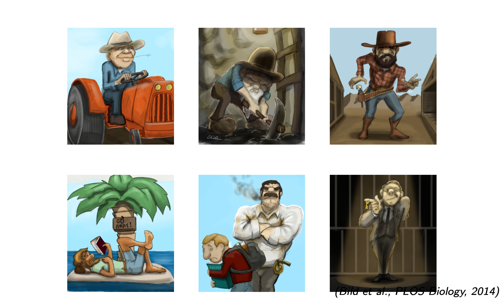
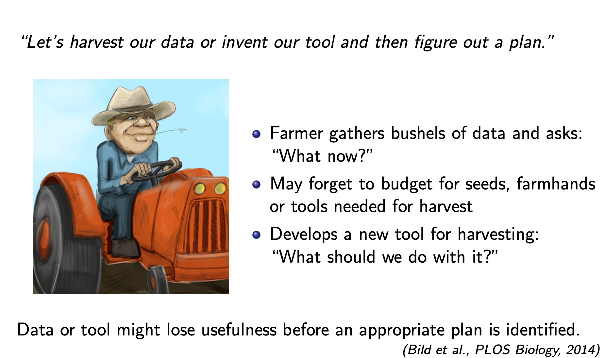
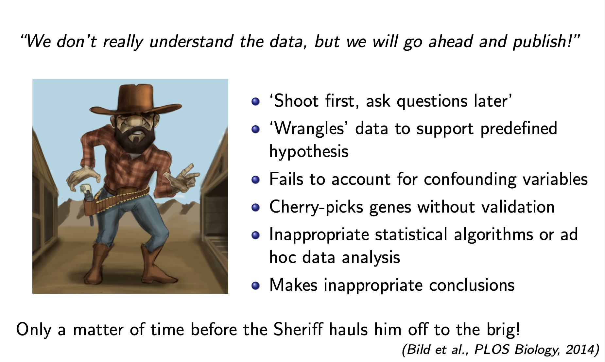
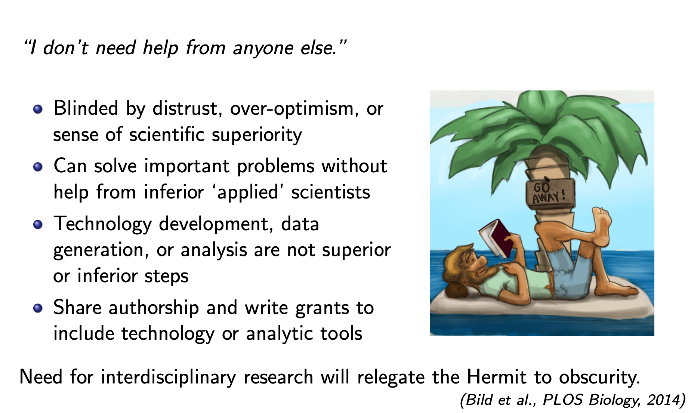
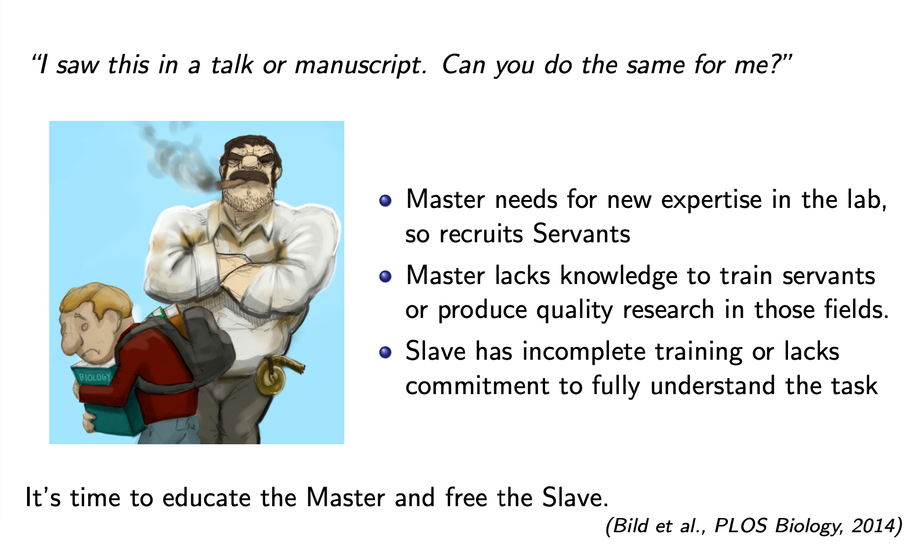
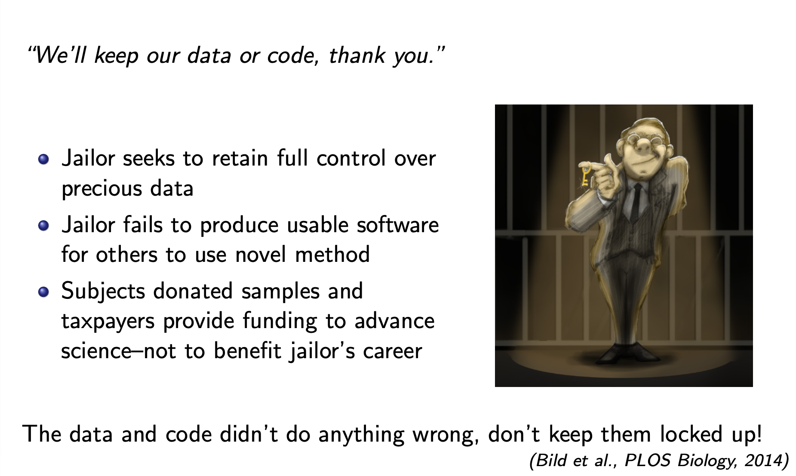
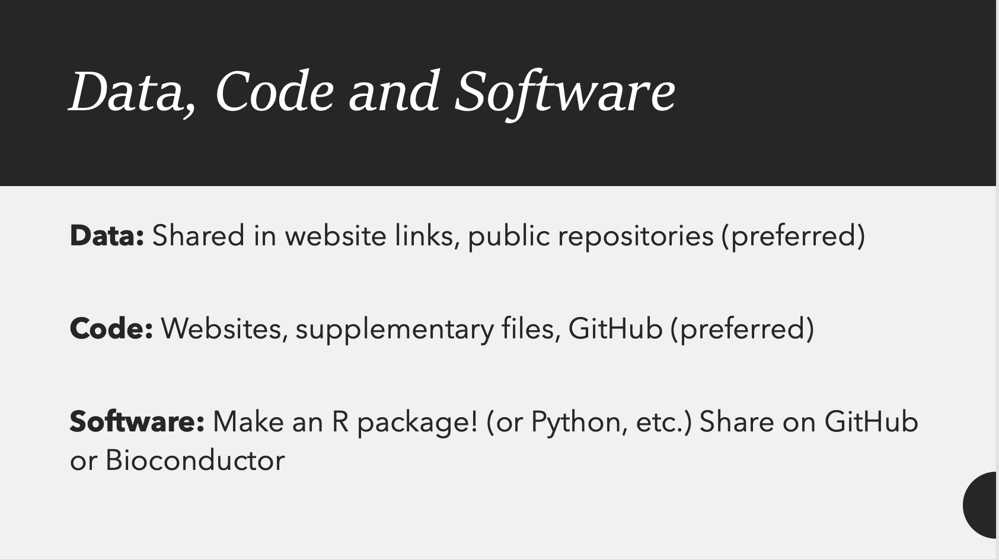
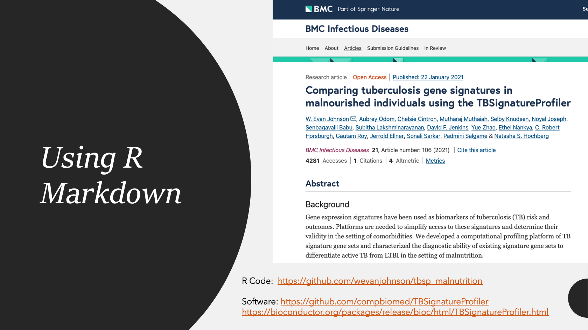
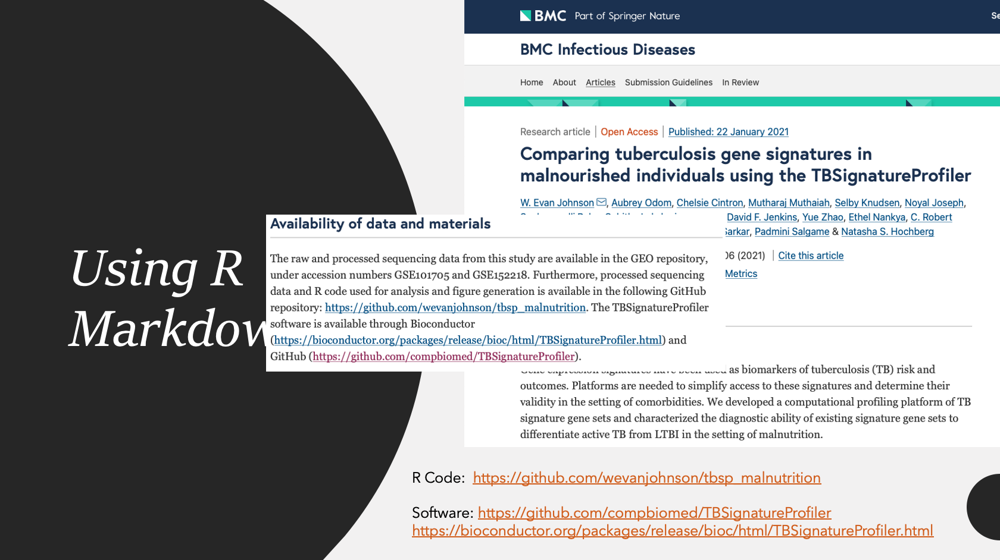
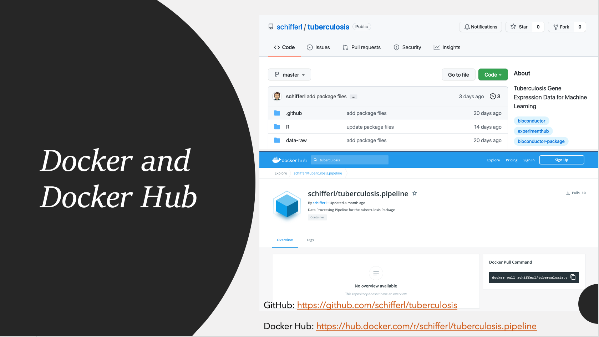

```{r setup, include=FALSE}
knitr::opts_chunk$set(echo = FALSE)
img_path <- "openfigs/"
```

## Problematic phenotypes in science (and business)


## The Farmer


## The Miner


## The Cowboy and the Sheriff


## The Hermit


## The Master and the Servant


## The Warden



## Open and Reproducible Science
Much of the rest of this material is taken from Dr. Verena Heise, her original slides can be found at: [https://osf.io/f9xbz/](https://osf.io/f9xbz/). 
\begin{center}
```{r, echo=FALSE,out.width="50%"}
knitr::include_graphics(file.path(img_path, "brain.png"))
```
\end{center}
I would also like to credit Dr. Prasad Patil at Boston University for his contributions to this side deck, and I would also like to acknowledge a litte help from ChatGPT! 


## Open and Reproducible Science
\Huge
\center
What is the problem?

## Open and Reproducible Science


## Reproducibility Crisis
\center
```{r, echo=FALSE,out.width="90%"}
knitr::include_graphics(file.path(img_path, "socialscience.png"))
```

## Reproducibility Crisis
\center
```{r, echo=FALSE,out.width="100%"}
knitr::include_graphics(file.path(img_path, "challenges.png"))
```

## Reproducibility Crisis
\center
```{r, echo=FALSE,out.width="100%"}
knitr::include_graphics(file.path(img_path, "data.png"))
```


## Reproducibility Crisis
Some Terminology:\vskip .2in

* Reproducible: a result can be recreated by others using the same data and analysis pipelines \vskip .2in
* Replicable: same scientific conclusion reached using independent data and (maybe) independent analysis pipelines\vskip .2in

$\Rightarrow$ The Reproducibility crisis is a Replication crisis

## Reproducibility Crisis
\center
```{r, echo=FALSE,out.width="100%"}
knitr::include_graphics(file.path(img_path, "goodforscience.png"))
```


## Reproducibility Crisis
\center
```{r, echo=FALSE,out.width="100%"}
knitr::include_graphics(file.path(img_path, "crisis1830.png"))
```

## Reproducibility Crisis
\center
```{r, echo=FALSE,out.width="100%"}
knitr::include_graphics(file.path(img_path, "crisis1830_1.png"))
```

## Reproducibility Crisis
\center
```{r, echo=FALSE,out.width="75%"}
knitr::include_graphics(file.path(img_path, "study1.png"))
```

## Reproducibility Crisis
\center
```{r, echo=FALSE,out.width="100%"}
knitr::include_graphics(file.path(img_path, "crisis1.png"))
```

## Reproducibility Crisis
\center
```{r, echo=FALSE,out.width="100%"}
knitr::include_graphics(file.path(img_path, "crisis2.png"))
```

## Reproducibility Crisis
\center
```{r, echo=FALSE,out.width="100%"}
knitr::include_graphics(file.path(img_path, "crisis3.png"))
```

## Reproducibility Crisis
\center
```{r, echo=FALSE,out.width="100%"}
knitr::include_graphics(file.path(img_path, "crisis4.png"))
```

## Reproducibility Crisis
\center
```{r, echo=FALSE,out.width="100%"}
knitr::include_graphics(file.path(img_path, "crisis5.png"))
```

## Reproducibility Crisis
\center
```{r, echo=FALSE,out.width="100%"}
knitr::include_graphics(file.path(img_path, "crisis6.png"))
```

## Reproducibility Crisis
\center
```{r, echo=FALSE,out.width="100%"}
knitr::include_graphics(file.path(img_path, "crisis7.png"))
```

## Reproducibility Crisis
\center
```{r, echo=FALSE,out.width="80%"}
knitr::include_graphics(file.path(img_path, "OSCreproduce.png"))
```


## Reproducibility Crisis
\center
```{r, echo=FALSE,out.width="90%"}
knitr::include_graphics(file.path(img_path, "OSCreproduce1.png"))
```

## Reproducibility Crisis
\center
```{r, echo=FALSE,out.width="80%"}
knitr::include_graphics(file.path(img_path, "OSCreproduce2.png"))
```


## Reproducible Science
\Huge
\center
Why do we care?

## Retracted Science
\center
```{r, echo=FALSE,out.width="75%"}
knitr::include_graphics(file.path(img_path, "retracted2.png"))
```

## Retracted Science
\center
```{r, echo=FALSE,out.width="75%"}
knitr::include_graphics(file.path(img_path, "retracted3.png"))
```

## Non-Reproducible Science
\center
```{r, echo=FALSE,out.width="100%"}
knitr::include_graphics(file.path(img_path, "drugs.png"))
```

## Retracted Science
\center
```{r, echo=FALSE,out.width="100%"}
knitr::include_graphics(file.path(img_path, "retraction.png"))
```

## Retracted Science
\begin{center}
```{r, echo=FALSE,out.width="100%"}
knitr::include_graphics(file.path(img_path, "hydroxytrial.png"))
```
\end{center}
77 clinical trials were launched testing hydroxychloroquine, and all failed, many terminated early 

## Reproducible research
\begin{center}
```{r, echo=FALSE,out.width="100%"}
knitr::include_graphics(file.path(img_path, "selfishreproduce.png"))
```
\end{center}
1. Reproducibility helps to avoid disaster
2. Reproducibility makes it easier to write papers
3. Reproducibility helps reviewers see it your way
4. Reproducibility enables continuity of your work
5. Reproducibility helps to build your reputation

## Reproducible Science
\Huge
\center
Potential solutions?


## Open Science

\small \center
(Open science elements based on UNESCO presentation of 17 February 2021)

## Good research practice
\center
```{r, echo=FALSE,out.width="90%"}
knitr::include_graphics(file.path(img_path, "research.png"))
```

## Some cool tools for reproducible science
- **RMarkdown**/**Jupyter Notebooks**: Interactive abd dynampic documents that combine code (R or Python), visualizations, narrative text, and output for fully reproducible reports.
  
- **R/Shiny**: Build interactive web applications for data analysis and visualization directly in R. Allows for building real-time dashboards for data exploration.
  
- **GitHub**: Version control and collaboration for code, documents, and workflows. Share and track changes to your research scripts.

- **Nextflow**/**Snakemake**: Workflow management for scalable and portable pipelines and automate multi-step computational analyses across platforms.

- **Docker**/**Singularity**: Containerization for consistent computational environments to ensure your code runs anywhere.


## Open Science Practices (Johnson Lab)


## Open Science Practices (Johnson Lab)
\center

\tiny
R Code: [https://github.com/wevanjohnson/tbsp_malnutrition](https://github.com/wevanjohnson/tbsp_malnutrition) 
Software: [https://github.com/compbiomed/TBSignatureProfiler]([https://github.com/compbiomed/TBSignatureProfiler) 
[https://bioconductor.org/packages/release/bioc/html/TBSignatureProfiler.html](https://bioconductor.org/packages/release/bioc/html/TBSignatureProfiler.html)


## Open Science Practices (Johnson Lab)
\center

\tiny
Data: [https://www.ncbi.nlm.nih.gov/geo/query/acc.cgi?acc=GSE101705](https://www.ncbi.nlm.nih.gov/geo/query/acc.cgi?acc=GSE101705) and [https://www.ncbi.nlm.nih.gov/geo/query/acc.cgi?acc=GSM4609421](https://www.ncbi.nlm.nih.gov/geo/query/acc.cgi?acc=GSM4609421)\
RMarkdown: [https://github.com/wevanjohnson/tbsp_malnutrition](https://github.com/wevanjohnson/tbsp_malnutrition)

## Open Science Practices (Johnson Lab)
\center

\tiny
Shiny app: [https://carbohydratequalitymicrobiome.shinyapps.io/supplementalapp/](https://carbohydratequalitymicrobiome.shinyapps.io/supplementalapp/)

## Open Science Practices (Johnson Lab)
\center

\tiny
GitHub: [https://github.com/schifferl/tuberculosis](https://github.com/schifferl/tuberculosis)\
Docker Hub: [https://hub.docker.com/r/schifferl/tuberculosis.pipeline](https://hub.docker.com/r/schifferl/tuberculosis.pipeline)


## What is Nextflow?
- A framework for writing and executing computational pipelines.
- Key features:
  - Supports **parallel** and **distributed** computing.
  - Works with multiple execution platforms (e.g., local, cloud, and HPC).
  - Script-based: Pipelines written in a domain-specific language (DSL) extending **Groovy**.

\footnotesize 
```groovy
process example_process {
    input:
    path input_file
    output:
    path output_file
    """
    cat $input_file > $output_file
    """
}
workflow {
    example_process(input_file: "data.txt", output_file: "result.txt")
}
```

## What is Docker?

* A platform for creating, deploying, and managing lightweight, portable containers.
* Why Docker?
  - Consistent environments across development, testing, and production.
  - Isolation of dependencies and libraries.
* Key terms:
  - Image: A snapshot of a container.
  - Container: A running instance of an image.

## What is Docker?

```bash
# Example Dockerfile
FROM ubuntu:20.04
RUN apt-get update && apt-get install -y python3
CMD ["python3", "--version"]
```

```bash
# Building and running a container
docker build -t my-python .
docker run my-python
```

## Integrating Nextflow and Docker

* Nextflow supports Docker natively for containerizing processes.
* Benefits:
  - Ensures pipeline portability.
  - Simplifies dependency management.

```groovy
process container_example {
    container 'ubuntu:20.04'
    script:
    """
    echo "Running in a container!"
    """
}
```

## Advantages of Using Nextflow and Docker

\Large
1. **Reproducibility:** Ensure pipelines run the same everywhere.
2. **Scalability:** Efficiently scale to cloud or HPC environments.
3. **Portability:** Share workflows and containers effortlessly.


## Resources

\Large
* [Nextflow Documentation](https://www.nextflow.io/docs/latest/index.html)
* [Docker Documentation](https://docs.docker.com)

## Open Science Practices
\center
```{r, echo=FALSE,out.width="90%"}
knitr::include_graphics(file.path(img_path, "pandemic.png"))
```

## Open Science Publishing
\center
```{r, echo=FALSE,out.width="90%"}
knitr::include_graphics(file.path(img_path, "openpublishing.png"))
```

## Open Science Publishing
\center
```{r, echo=FALSE,out.width="90%"}
knitr::include_graphics(file.path(img_path, "openpublishing2.png"))
```

## Open Science Data
\center
```{r, echo=FALSE,out.width="90%"}
knitr::include_graphics(file.path(img_path, "opendata.png"))
```


## Open Science Methods
\center
```{r, echo=FALSE,out.width="90%"}
knitr::include_graphics(file.path(img_path, "openmethods.png"))
```


## Open Science reporting
\center
```{r, echo=FALSE,out.width="90%"}
knitr::include_graphics(file.path(img_path, "openreporting.png"))
```

## Attention: Terminal
\Large
**Note: For the next lecture, you need access to a Terminal!** 

For Mac Users, the work is already done for you, just: 

- Open the **Terminal** App on your Mac, or
- Use the terminal directly from RStudio


## Attention: Windows Users
\large
- **Git Bash** is a terminal for Windows that provides a Git command-line experience.
  - It allows users to interact with their repositories and run shell commands.

- Visit the official Git website: [https://git-scm.com/](https://git-scm.com/)
  - Click on the "Download for Windows" button and install the program.
- Once installed, launch Git Bash by searching for it in the Windows Start Menu.


## Session Info
\tiny
```{r pressure}
sessionInfo()
```


