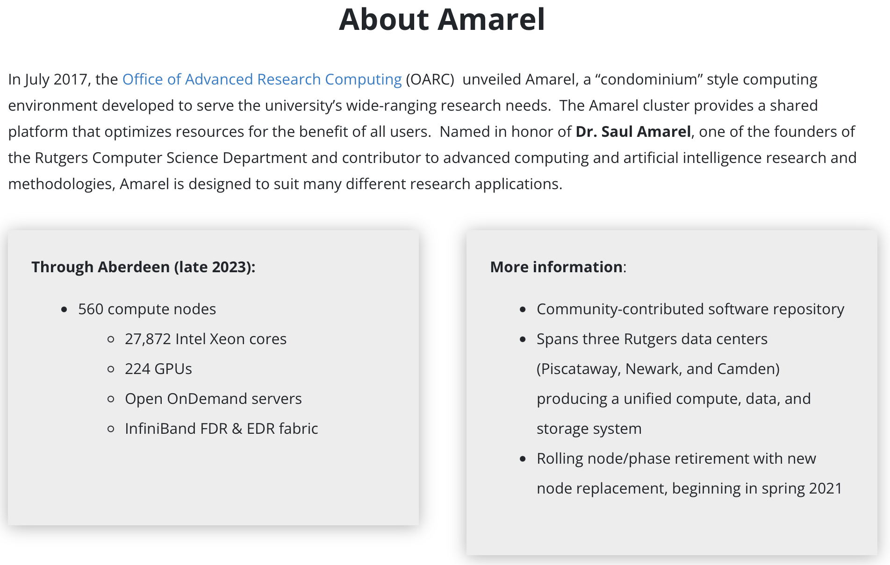

```{r setup, include=FALSE}
knitr::opts_chunk$set(echo = TRUE, fig.align="center")
```

# Introduction to Unix

## Unix Introduction

**Unix** is a family of multitasking, multiuser computer operating systems that derive from the original AT\&T Unix. Originally developed in 1969 at Bell Labs. (Thanks Dennis Ritchie and Ken Thompson!)

\begin{center}
\includegraphics[height=2in]{unixfigs/thompson_richie.png}
\end{center}

## Unix Introduction

The Unix operating system consists of many libraries and utilities along with the master control program, the kernel. 

\begin{center}
\includegraphics[height=2in]{unixfigs/unix_architecture.jpg}
\includegraphics[height=2in]{unixfigs/unix-operating-system2.png}
\end{center}

## History of operating systems
Most operating systems can be grouped into two lineages: 

* Microsoft’s Windows NT-based operating systems
* “Unix-like” operating systems (e.g., Linux, Mac OS X, Android, iOS, Chrome OS, Orbis OS used on the PlayStation 4, firmware on your router)

\begin{center}
\includegraphics[height=1.25in]{unixfigs/6201_8196_0.jpg}
\includegraphics[height=1.25in]{unixfigs/scr_preview_darwin.jpg}
\end{center}


## Unix and Data Science 
**Unix** is the operating system of choice in data science. \vskip .2in
We will introduce you to the Unix way of thinking using an example: how to keep a data analysis project organized, and later how to do things more efficiently. \vskip .2in
We will learn some of the most commonly used commands along the way.  


# Learning Unix

## Naming conventions

Before you start, pick a name convention that you will use to systematically name your files and directories. The Smithsonian Data Management Best Practices has ``five precepts of file naming and organization":

* Have a distinctive, human-readable name that gives an indication of the content.
* Follow a consistent pattern that is machine-friendly.
*	Organize files into directories (when necessary) that follow a consistent pattern.
* Avoid repetition of semantic elements among file and directory names.
* Have a file extension that matches the file format (no changing extensions!)

The Tidyverse Style Guide^[https://style.tidyverse.org/] is highly recommended!

# The Terminal

## Attention: Windows users
\large
- **Git Bash** is a terminal for Windows that provides a Git command-line experience.
- It allows users to interact with their repositories and run shell commands.
- The following slides will guide you through the installation process.
- **Mac users:** nothing to see here! Move on! 

## Step 1: Download Git Bash
\Large
- Visit the official Git website: [https://git-scm.com/](https://git-scm.com/)
- Click on the "Download for Windows" button.


## Step 2: Run the Installer

\large
1. Locate the downloaded .exe file in your downloads folder.
2. Double-click to start the installer.
3. Follow the prompts in the setup wizard:
  - Choose default options unless you have specific requirements.
  - Ensure Git Bash is selected as a component.

## Step 3: Complete Installation

\Large
- Once installed, launch Git Bash by searching for it in the Windows Start Menu.
- You’re now ready to use Git Bash for your projects!


## Mac Users

\Large
- Open the **Terminal** App on your Mac, or
- Use the terminal directly from RStudio

## Basic Unix Commands
Instead of clicking, dragging, and dropping files and folders, we will be typing Unix commands into the terminal. (Similar typing commands into the R console!) \vskip .1in

You will need access to a terminal. Once you have a terminal open, you can start typing into the *command line*, usually after a `$` or `%` symbol. Once you hit enter, Unix will try to execute this command. For example:

```{bash}
echo "hello world"
```

## Basic Unix Commands

The command `echo` is similar to `cat` in R. Executing this line should print out `hello world`, then return back to the command line. \vskip .2in

Notice that you can't use the mouse to move around in the terminal. You have to use the keyboard. To go back to a previous command, you can use the up arrow.

# Files and directories

## The filesystem

We refer to all the files, folders, and programs on your computer as the **filesystem**.  Keep in mind that folders and programs are also files (for later discussion). We will focus on files and folders for now and discuss programs, or **executables**, in a later section.\vskip .2in

The first concept top understand is how your filesystem is organized; a series of nested folders, each containing files, folders, and executables. 


## Directories and subdirectories
Here is a  representation of the structure we are describing:

\begin{center}
\includegraphics[width=3 in]{unixfigs/filesystem.png}
\end{center}

In Unix, we refer to folders as **directories**. Directories  inside other directories referred to as **subdirectories**.

## The home directory

The **home directory** is where your stuff is kept, as opposed to the system files, which are kept elsewhere. The name of your home directory is likely the same as your username. For example:

\begin{center}
\includegraphics[height=1.5 in]{unixfigs/VirtualBox_Windows-7-Enterprise_23_03_2018_14_53_13.png}
\includegraphics[height=1.5in]{unixfigs/mac_home.png}
\end{center}

## Windows filesystem structure

The Windows filesystem structure^[**Windows Users:** The typical R installation will make your `Documents` directory your home directory in R. This will likely be different from your home directory in Git Bash.] looks like this:

\begin{center}
\includegraphics[width=4.5in]{unixfigs/windows-filesystem-from-root.png}
\end{center}

## Mac filesystem structure

The Mac filesystem structure looks like this:
\begin{center}
\includegraphics[width=4.5in]{unixfigs/mac-filesystem-from-root.png}
\end{center}


## Working directory

In Unix, the concept of a current location is indispensable. We refer to this as the **working directory**. Each terminal window you have open has a working directory. \vskip .1in

How do we know our working directory? We use the Unix command: `pwd`, which stands for *print working directory*:

```{bash, eval=F}
pwd
```

## Paths

The string returned by `pwd` is the **full path** of the working directory. Every directory has a full path. Later, we will learn about **relative paths**, which tell us how to get to a directory from the working directory. \vskip .2in

In Unix, the shorthand `~` is a nickname for your home directory. So, for example, if `docs` is a directory in your home directory, the full path can be written `~/docs`. 

# Basic Unix Commands

## Some Basic Unix Commands

To see the content of your home directory, open a terminal and type:
```{bash, eval=F}
ls
```

You can also add **options** (\texttt{`-'} and \texttt{`--'}), **arguments**, and **wild cards** (\texttt{`*'}) to change function behavior: 
```{bash, eval=F}
ls -l
ls -a
ls -t
ls -r
ls -lart
ls -l *.txt
```


## Some Basic Unix Commands

To create and remove directories, use the \texttt{mkdir} and \texttt{rmdir} functions, for example (use \texttt{ls} in between to see the directory come and go): 

```{bash, eval=F}
mkdir projects
mkdir junk
rmdir projects
```

__Note:__ \texttt{rmdir} does not work if the directory is not empty.\
__Pro tip 1:__ The up arrow retrieves your previous commands.\
__Pro tip 2:__ You can auto-complete by hitting tab.


## Some Basic Unix Commands
To change the working directory use the \texttt{cd} command, which stands for _change directory_. For example:

```{bash,  eval=F}
cd projects
```

To check that it worked, use \texttt{pwd}. Now try: 

```{bash,  eval=F}
cd .
cd ..
cd ../..
cd /
cd ~
cd ~/projects
cd ../junk
```

## Some Basic Unix Commands
In Unix, we move files from one directory using the \texttt{mv} command: 

```{bash,  eval=F}
mv path-to-file path-to-destination-directory
```

**Warning:** \texttt{mv} will not ask "are you sure?" if your move results in overwriting a file.  Some \texttt{mv} examples: 

```{bash,  eval=F}
mkdir ~/junk ~/projects/resumes
touch ~/projects/resumes/cv.tex
mv ~/projects/resumes/cv.tex ../../
mv ~/cv.tex ~/mycv.tex
mv ~/projects/mycv.tex junk/
mv ~/junk/mycv.tex ../projects/resumes/
```

## Some Basic Unix Commands
The command \texttt{cp} behaves similar to \texttt{mv} except instead of moving, we copy the file.

```{bash,  eval=F}
cp ~/projects/resumes/mycv.tex ~/mycv.tex
```

So in all the \texttt{mv} examples in the prior slide, you can switch \texttt{mv} to \texttt{cp} and they will copy instead of move. However to copy entire directories, add the recursive (\texttt{-r}) option:


```{bash,  eval=F}
cp -r ~/projects/resumes ~/junk/
```

## Some Basic Unix Commands

In Unix, we remove files (and directories) with the \texttt{rm} command. 
```{bash,  eval=F}
rm filename
```

**Warning:** Unlike throwing files into the trash or recycle bin, \texttt{rm} is permanent. Be careful! Note the following: 

```{bash,  eval=F}
rm mycv.tex
rm junk/*.tex
rm -r projects junk
```

## Some Basic Unix Commands

Unix uses an extreme version of abbreviations, which makes it hard to guess how to call commands. However, Unix includes complete help files or **man pages** (man is short for manual). In most systems, you can type \texttt{man} followed by the command name to get help. For example:

```{bash,  eval=F}
$ man ls
```

This command is not available in some of compact implementations of Unix (e.g., Git Bash). Alternatively, we can type the command followed by \texttt{--help}: 

```{bash,  eval=F}
ls --help
```

## Advanced Unix functions

Most Unix implementations include a large number of powerful tools and utilities. It will take time to become comfortable with Unix, but as you struggle, you will find yourself learning just by looking up solutions on the internet.\vskip .1in 

In your Homework, you will cover more advanced Unix functions such as `chmod`, `less`, `vim`, `grep`, `ln`, `tar`, `ssh`, and `pipes`. (and `git`!!!) Stay tuned!


## Additional Unix Resources
Here are some resources more information: 

* https://www.codecademy.com/learn/learn-the-command-line
* https://www.edx.org/course/introduction-linux-linuxfoundationx-lfs101x-1
* https://www.coursera.org/learn/unix
\vskip .2in
 
There are many reference books as well. Here are some particularly clear, succinct, and complete examples: 

* https://www.quora.com/Which-are-the-best-Unix-Linux-reference-books
* https://gumroad.com/l/bite-size-linux 
* https://jvns.ca/blog/2018/08/05/new-zine--bite-size-command-line/ 

# Next Lecture: Introduction to the Amarel HPC Cluster

## Next Lecture: HPC at Rutgers University 

At Rutgers, the primary High Performance Computing (HPC) resources are governed by the [Rutgers Office of Advanced Research and Computing (OARC)](https://sites.google.com/view/cluster-user-guide/amarel/welcome?authuser=0). They provide significant online and synchronous (in person) resources for HPC, along with training in batch submission, programming languages, parallel programming, distributed systems, and HPC architectures.

## Next Lecture: HPC at Rutgers
\center 
{width=90%}

[Click here for a short video about the Amarel cluster!](https://www.youtube.com/watch?v=GECyL_5NcAk&t=25s)


## Next Lecture: Getting Started with Amarel
If you are off campus, you will need access to VPN:

\vskip .1in
[Click Here for Rutgers VPN instructions for Windows Users](https://ithelp.rutgers.edu/sp?id=kb_article&sysparm_article=KB0015634&sys_kb_id=ab3e9a5c1b18c2d0723a99b51a4bcb1b&spa=1)

\vskip .1in
[Click Here for Rutgers VPN instructions for Mac Users](https://ithelp.rutgers.edu/sp?id=kb_article&sysparm_article=KB0015620&sys_kb_id=6a95445e1b777110727cc9d2604bcbb5&spa=1)


## Next Lecture: Getting Started with Amarel

1. [**Request Access (Click Here)**: OARC webpage to request access to Amarel](https://oarc.rutgers.edu/amarel-cluster-access-request/)
2. **Training Workshops**: Attend training workshops offered by OARC to learn how to use Amarel effectively.
3. [**Documentation and Support (Click Here)**: Explore documentation and seek support from OARC staff and the user community.](https://sites.google.com/view/cluster-user-guide)
4. **Start Small**: Begin with small-scale experiments and gradually scale up as needed.

## Session info
\tiny
```{r session info}
sessionInfo()
```


