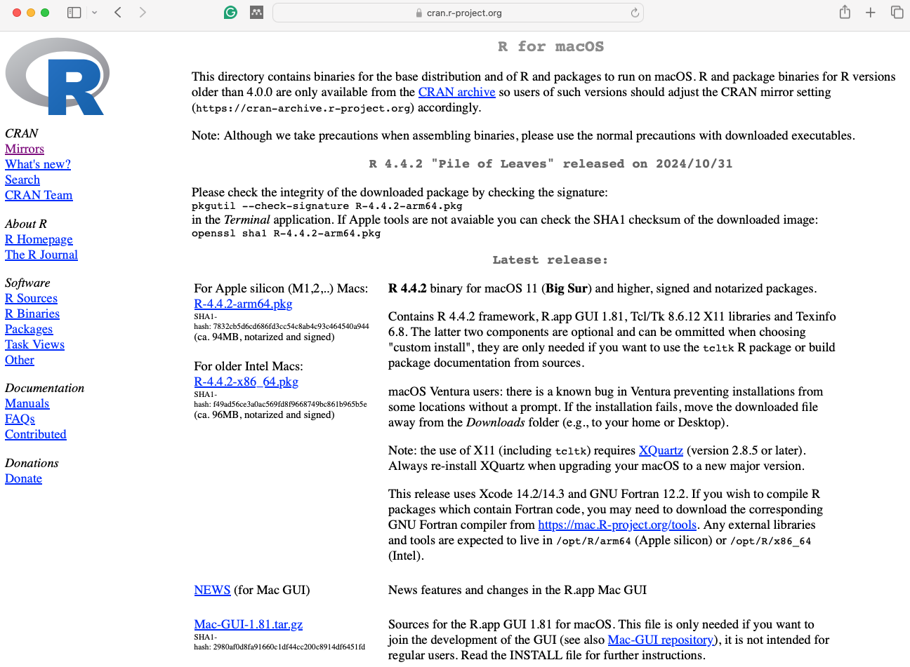
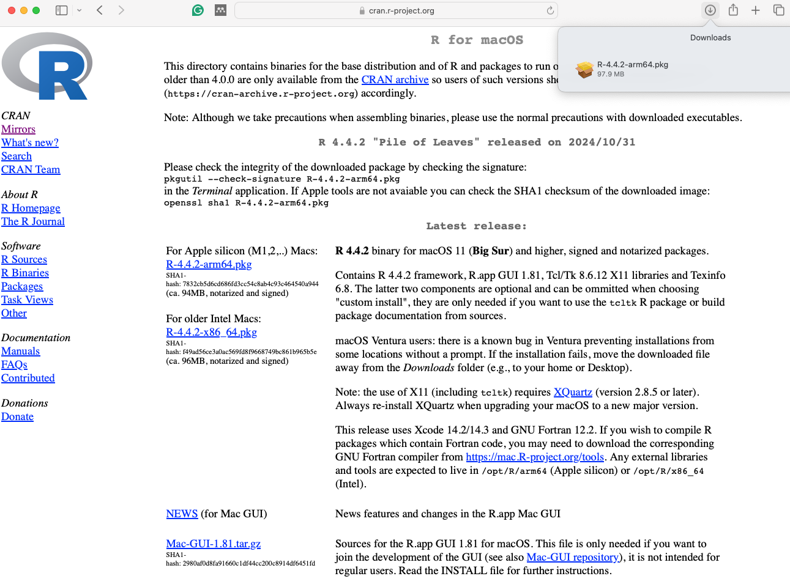
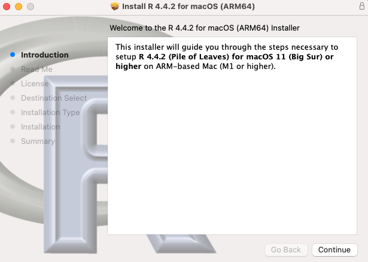
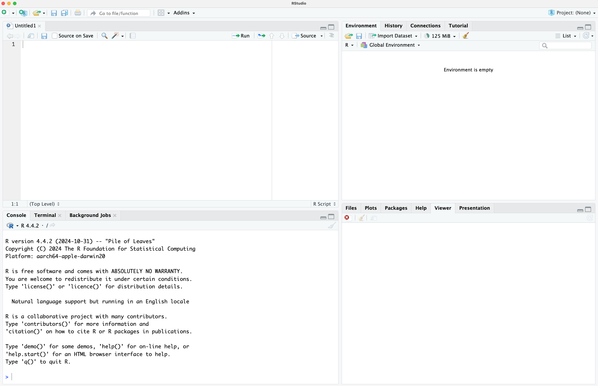
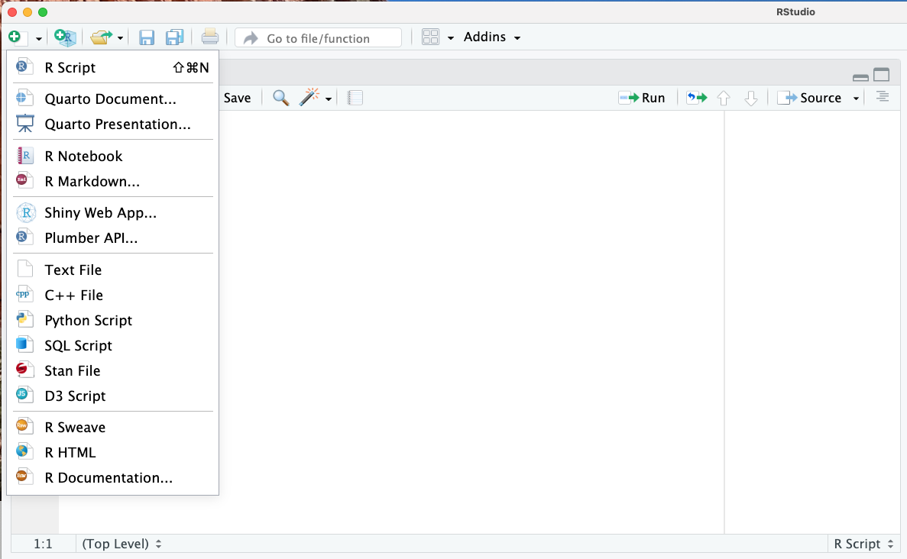
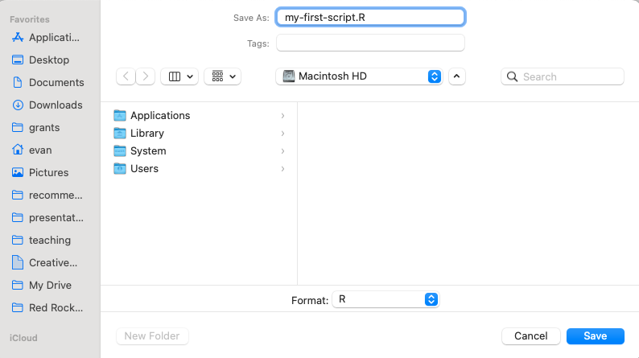
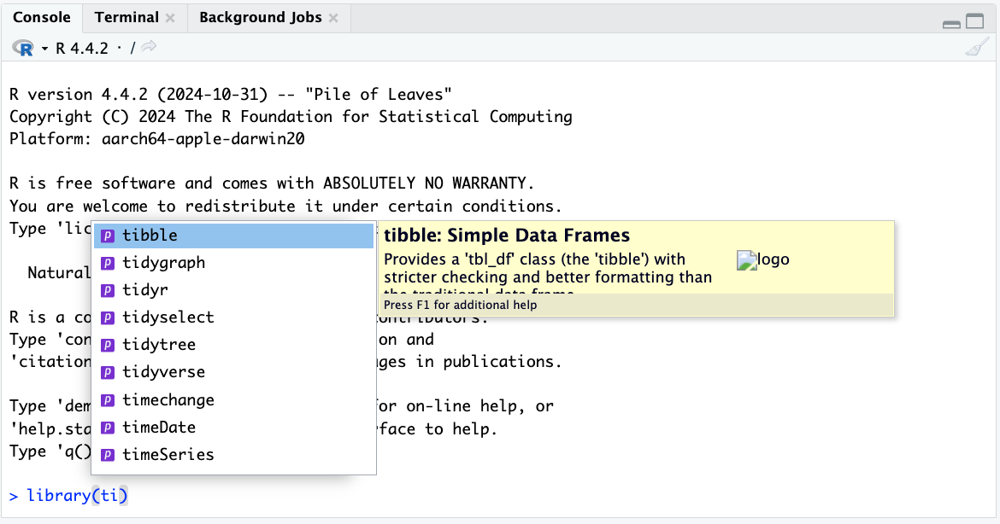
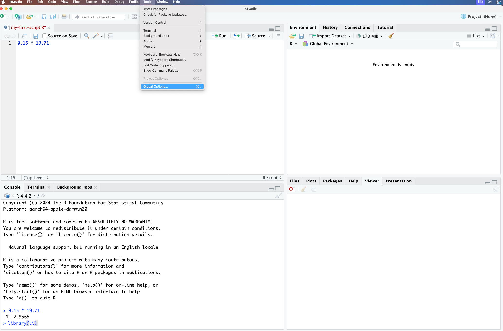
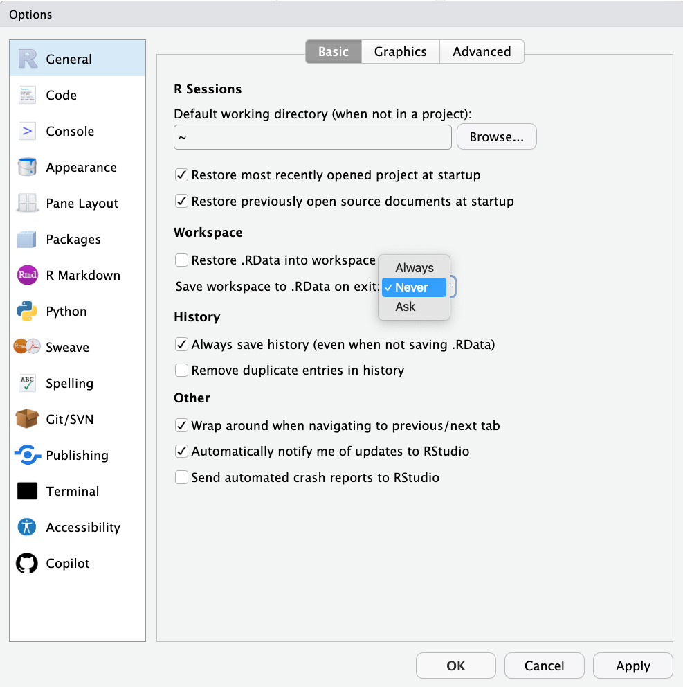
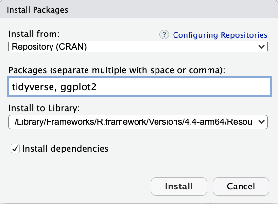

```{r setup, include=FALSE}
knitr::opts_chunk$set(echo = TRUE, fig.align="center",out.width="5in")
```

## Installing R and RStudio

**R** is a language for statistical computing and graphics. **RStudio** is an interactive desktop environment (IDE), but it is not R, nor does it include R when you download and install it. Therefore, to use RStudio, we first need to install R.

\center
{height=50%}

## Installing R (Windows and Mac)

Download R from the Comprehensive R Archive Network (CRAN): [https://cran.r-project.org/](https://cran.r-project.org/). Search for "CRAN" on your browser:


\center


## Installing (Windows and Mac) 

Once on the CRAN page, select the version for your operating system: Linux, Mac OS X, or Windows. Here we show screenshots for Windows, but the process is similar for the other platforms. When they differ, we will also show screenshots for Mac OS X.

\center


## Installing R (Windows)

Once at the CRAN download page, you will have several choices. You want to install the _base_ subdirectory. This installs the basic packages you need to get started. We will later learn how to install other needed packages from within R.

\center


## Installing R (Windows)
Click on the link for the latest version to start the download.

\center


## Installing R (Windows)
Once the installer file downloads, you can click on that tab to start the installation process. Some browsers may display this differently, so you will have to find where they store downloaded files and click on them to get the process started.

## Installing R (Mac)
If using Safari on a Mac, things may look a little different:

\center



## Installing R (Mac)
If using Safari on a Mac, you can access the download through the download button.

\center


## Installing R (Windows)
You can now click through different choices to finish the installation. We recommend you select all the default choices.

\center


## Installing R (Windows)
Continue to select all the defaults until you have completed the setup:

\center
{width='80%'}


## Installing R (Mac)
On the Mac it looks different, but you are again just accepting the defaults:

\center
{width='60%'}

## Installing R (Mac)
Congratulations! You have installed R. 

\center
{width="60%"}


## Installing RStudio (Windows and Mac)

To install RStudio, start by searching for "RStudio" on your browser:

\center


## Installing RStudio (Mac)
You should find the Posit/RStudio website as shown above. Once there, click on "Download RStudio Desktop for Mac OS 12+" below the _2: Install RStudio_ header. We first focus on Mac installation. 

\center


## Installing RStudio (Mac)
The download process should start. For Safari on Mac, you should see the progress in the bar at the top right. Double click on the download when its complete.  

\center


## Installing RStudio (Mac)
Now drag and drop the RStudio icon over the Applications icon:

\center


## Installing RStudio (Mac)
If you have a previous version of RStudio installed, it may ask if you want to overwrite the old version. We usually want to replace the old with the new, so click "Replace".

\center


## Installing RStudio (Mac)
The system should copy RStudio to the Applications folder: 

\center


## Running RStudio (Mac)
Congratulations! You have installed RStudio. On the Mac, it will be in the Applications folder. Or you can click on the _Spotlight Search_ (magnifying glass in top right corner) and type rstudio into that search bar, then hit enter.

\center


## Installing RStudio (Mac)
You may get a warning that RStudio is an application downloaded from the internet. Go ahead and click "Open".

\center


## Installing RStudio (Windows)
For Windows, the process is similar. From the RStudio main page, click on "Download RStudio Desktop for Windows" below the _2: Install RStudio_ header. 

\center


## Installing RStudio (Windows)
You may receive a warning, just click "Yes" to continue the install. 

\center
{ width=50% }


## Installing RStudio (Windows)
Follow the instructions to install RStudio, defaults are fine.
\center
{ width=50% }

## Installing RStudio (Windows)
Congratulations! You are done! 
\center
{ width=50% }

## Running RStudio (Windows)
On Windows, you can open RStudio from the _Start_ menu:

\center
{width="50%"}

## Getting started: Why R?

R is not a programming language for software development like C or Java. It was created by statisticians as an environment for data analysis. A history of R is summarized here: [A Brief History of S](http://lcolladotor.github.io/courses/Courses/R/resources/history_of_S.pdf). 

The __interactivity__ of R (more later), is an indispensable feature in data science because, as you will learn, the ability to quickly explore data is a necessity for success in this field. 

## Getting started: Why R?
R does not follow conventions of "traditional" programming languages. However, R has unmatched utility when it comes to data analysis and data visualization.

A history of R is summarized here: [A Brief History of S](http://lcolladotor.github.io/courses/Courses/R/resources/history_of_S.pdf). 

\center
{height=50%}


## Getting started: Why R?
Other attractive features of R are:

1. R is [free and open source](https://opensource.org/history).
2. It runs on all major platforms: Windows, Mac Os, UNIX/Linux.
3. Scripts and data objects can be shared seamlessly across platforms.
4. There is a large, growing, and active community of R users and, as a result, there are numerous resources for learning and asking questions^[https://www.r-project.org/help.html] ^[https://stackoverflow.com/documentation/r/topics] ^[https://stats.stackexchange.com/questions/138/free-resources-for-learning-r]. 
5. It is easy for others to contribute add-ons which enables developers to share software implementations of new data science methodologies.


## RStudio 

RStudio will be our launching pad for data science projects. It provides an editor for our scripts and provides many other useful tools. Here are some of the basics.

\center
{height=25%}

## RStudio Panes

When you start RStudio, you will see three or four panes:
\center
{width='60%'}

## The R console

Interactive data analysis usually occurs on the _R console_. As a quick example, try using the console to calculate a 15% tip on a meal that cost $19.71:

```{r, tip_calculator}
0.15 * 19.71  
```

**Pro Tip:** Grey boxes in the lecture notes are used to show R code typed into the R console. The symbol `##` is used to denote what the R console outputs.

## Running commands while editing scripts
Let's start by opening a new script and giving the script a name. We can do this through the editor by saving the current new unnamed script.  

\center
{width="150%"}


## Running commands while editing scripts
When saving a script, a good convention is to use a descriptive name, with lower case letters, no spaces, only hyphens to separate words, and then followed by the suffix _.R_. We will call this script _my-first-script.R_.

\center
{width="60%"}


## Running commands while editing scripts
Now we are ready to start running our first script. There are many ways to execute a script in R/RStudio:

1. **Run Line by Line**: Place the cursor on a line and press **Ctrl+Enter** (Windows/Linux) or **Cmd+Enter** (Mac).
2. **Select and Run**: Highlight code and press **Ctrl+Enter** (Windows/Linux) or **Cmd+Enter** (Mac).
3. **Run Entire Script**: Click **Source** or press **Ctrl+Shift+Enter** (Windows/Linux) or **Cmd+Shift+Enter** (Mac).
4. **Use `source()`**: Execute the script from the console with:
```{r, eval=F}
source("path/to/your_script.R")
```

## Organizing scripts
The first lines of code in an R script are dedicated to loading the libraries we will use. One useful feature is RStudio's auto-complete: note what happens when we type `library(ti)`:

\center
{width="60%"}


## Changing global options
You can change the look and functionality of RStudio quite a bit. 

To change global options you click on _Tools_ then _Global Options_: 

\center



## Changing global options
I **highly recommend** to change the _Save workspace to .RData on exit_ to _Never_ and uncheck the _Restore .RData into workspace at start_. To change these options, make your _General_ settings look like this:

\center


## Changing global options
Also, click on _Appearance_ then try the _Cobalt_ option for the _Editor theme_:

\center
{height="80%"}

## Installing R packages

The functionality provided by a fresh install of R is only a small fraction of what is possible. In fact, we refer to what you get after your first install as __base R__. The extra functionality comes from add-ons available from developers. 

There are currently hundreds of these available from CRAN and many others shared via other repositories such as GitHub. However, because not everybody needs all available functionality, R instead makes different components available via __packages__. 

## Installing R packages
R makes it very easy to install packages from within R. For example, to install the __tidyverse__ package, which we use to wrangle data in later sessions:

```{r,eval=FALSE}
install.packages("tidyverse")
```

We can install more than one package at once by feeding a character vector to this function:

```{r, eval=FALSE, echo=TRUE}
install.packages(c("tidyverse", "ggplot2"))
```

## Installing R packages (Windows)
If you are using Windows, you may get a warning that says:

`WARNING: Rtools is required to build R packages but is not currently installed.` 

**Rtools** is a toolchain bundle used for building R packages from source (those that need compilation of C/C++ or Fortran code) and to build R itself from source. We won't cover this here, but for a detailed step-by-step instruction tutorial can be found by clicking the following link: 

\center \footnotesize
[https://jtleek.com/modules/01_DataScientistToolbox/02_10_rtools/](https://jtleek.com/modules/01_DataScientistToolbox/02_10_rtools/)


## Installing R packages
In RStudio, you can navigate to the __Tools__ tab and select install packages this way: 

\center
{width='60%'}

## Installing R packages
Remember packages are installed in R not RStudio. Also note that installing __tidyverse__ actually installs several packages. This commonly occurs when a package has **dependencies**, or uses functions from other packages. When you load a package using `library`, you also load its dependencies.

## Installing R packages
Once packages are installed, you can load them into R using the `library` function: 
```{r, eval=F}
library(tidyverse)
```

As you go through this tutorial, you will see that we load packages without installing them. This is because once you install a package, it remains installed and only needs to be loaded with `library`. The package remains loaded until we quit the R session. If you try to load a package and get an error, it probably means you need to install it first. 

## Installing R packages
**Pro Tip:** It is helpful to keep a list of all the packages you need for your work in a script because if you need to perform a fresh install of R, you can re-install all your packages by simply running a script.

You can see all the packages you have installed using the following function:

```{r, eval=FALSE, echo=TRUE}
installed.packages()
```


## Session Info
The `sessionInfo()` function reports information about your R session. Its always good to end your analyses and reports with this function for reproducibility. 
\tiny
```{r session}
sessionInfo()
```